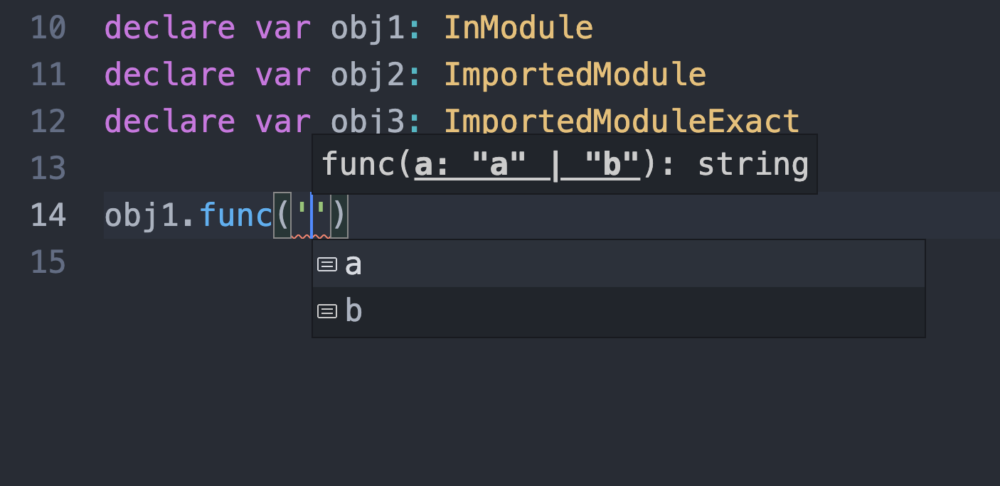

# string-literal-repro

## Edit

I have since found the root cause [here](https://github.com/facebook/flow/issues/8723)

Flow DOES correctly show auto complete suggestions from string literal unions but you must use the `ctrl + space` command to populate them. There is no other way currently to show these options at the top of the autocomplete list.

Also important to note that as of right now, the autocomplete will always populate the value with double quotes. But I've been told in the future that `format.single_quotes=true` will be hooked up to support formatting on autocomplete results and not just import statements as it currently works.

We can tell the results are from flow and not any other extension such as TS by the orange icon.

---

Reproduction of string literals not showing up in dropdown when exact object syntax is used.

